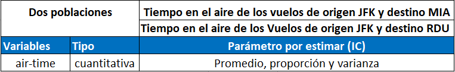
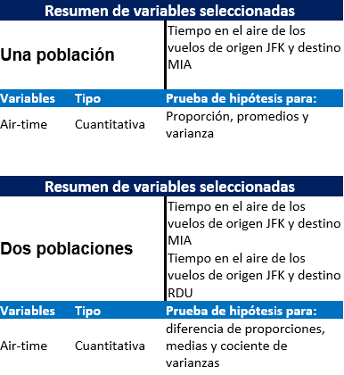

\newpage

### Nombre de la base de datos

nycflights13

### Descripción del dataset seleccionado

La base utilizada para el proyecto contiene información sobre todos los vuelos que salían de NUEVA YORK (por ejemplo EWR, JFK Y LGA)a destinos en los Estados Unidos, Puerto Rico y las Islas Vírgenes Americanas) en 2013: 336,776 vuelos en total. Para ayudar a comprender qué provoca retrasos, también incluye otros conjuntos de datos útiles. La base que está siendo utilizada contiene muchas tablas de datos como vuelos, climas, aviones, aeropuertos etc, para el desarrollo del presente proyecto se eligió la columna flights o vuelos. 

El paquete flights o vuelos se divide en varias columnas como año, hora de salida, minutos, avión, origen destino y muchos otros. Para el manejo de este proyecto se trabajó con tres columnas respectivas, la de origen, destino y duración en el aire, las cuales fueron utilizadas en pruebas de una y dos poblaciones. Para la prueba se tomaron un origen y un destino en el cual se toma la duración entre ese respectivo origen y destino.

- \n
- \n

### Librerías necesarias

- \n

if (!require('devtools')) install.packages('devtools')
devtools::install_github('fhernanb/stests', force=TRUE)


```{r}
library(nycflights13)
library(mosaicData)

library(PASWR2)

library(stests)

library(BSDA)

library(visdat)
library(remotes)

library(DataExplorer)
library(MASS)
library(TeachingDemos)
library(ggplot2)
library(datos)
library(fBasics)
library(nortest)
library(EnvStats)
library(ggplot2)

data("flights")

mosaicData <- mosaicData::KidsFeet

dataFlight <- flights
dataDiamonds <- ggplot2::diamonds

dataFlight
mosaicData


#if (!require('devtools')) install.packages('devtools')
#devtools::install_github('fhernanb/stests', force=TRUE)
```

- \n

### Variables de la base datos

- \n

```{r}
dataFlight
dataDiamonds
```


- \n

### Resumen de variables seleccionadas

#### La siguiente variable fue utilizada para una y dos poblaciones, en donde se utilizaba la duración en aire de un destino al otro.


-\n




- \n 

### Gráficos 
```{r}
dataFlight <- flights
plot_missing(dataFlight)
```

El gráfico anterior nos demuestra que la escogencia de los datos está basada en una base datos confiable, ya que
como se puede observar, los datos presentan un buen comportamiento. También, se presentan datos en blanco, pero el porcentaje es muy pequeño lo cual hace que el dataset sea óptimo para hacer cálculos estadísticos.

- \n

- \n

```{r}
dataFlight <- flights
vuelos <- na.omit(dataFlight)
vis_dat(vuelos,warn_large_data = FALSE)

```

En el gráfico anterior, se puede observar los tipos de variables, el nombre que cada una tiene, así como la cantidad de datos que contienen. Cabe resaltar que para este gráfico se eliminaron los valores en blanco.

# Pruebas de intervalos de confianza para una población

- \n


## **Distribución normal Z**

En la siguiente prueba se procederá a realizar los respectivos procedimientos con la distribución normal z, en la cual se tomará un nivel de confianza del 95%.
Se tomaron datos de una población con un comportamiento normal. Se tomaron los tiempos en vuelo de todos los vuelos de origen JFK y destino MIA, este es el valor de 'x' en la función. Para el valor del sigma.x se tomó la desviación estándar de esos tiempos en aire de los vuelos y el conf.level significa el nivel de confianza para el intervalo, que es nuestro caso es de 95%. Para esta prueba se usó la librería 'BSDA'.

- \n

### **Resultados**
```{r}

#En la siguiente asignación se toman la cantidad del tiempo de aire de los vuelos que salen de JFK y tienen como destino MIA, y  guarda en var1 sólo los vuelos con dichas características.
var1 <- na.omit(dataFlight[dataFlight$origin == "JFK" & dataFlight$dest == "MIA", ]$air_time)

#En esta variable se trabaja con el tiempo en el aire de el origen y destino seleccionado anteriormente.

#Se procede a aplicar la función de PASWR2, en la cual se le pasan como parametros la lista de tiempos, la desviación estandar y por último el nivel de significancia.
BSDA:: z.test(x = var1, sigma.x = sd(var1), conf.level = 0.95)$conf.int

```

- \n

### **Conclusión**
Al realizar los respectivos cálculos de la distribución normal z con '3285'que es cantidad de tiempos de vuelos con origen JFK y destino a MIA se obtuvo un intervalo de confianza de 95% para el promedio del tiempo de vuelo desde JFK a MIA dado por: ]151.7496, 152.5103[.

- \n

## **Distribución T**

En la siguiente prueba se procederá a realizar los respectivos cálculos con la distribución TStudent, en la cual se tomará un nivel de confianza del 95%. Esta distribución debe tener un n < 30, por lo que se tomó una muestra aleatoria de tamaño 25, correspondientes a la columna de *air_time* para dicha prueba. Cabe destacar que la población presenta un compartamiento normal. Para esta prueba se usó la librería 'stats'.

- \n

### **Resultados**
```{r}
#En la siguiente asignación se toman las n cantidad de vuelos que salen de JFK y tienen como destino MIA, y guarda en var1 sólo los vuelos con dichas características.

#En esta variable se trabaja con el tiempo (air-time) en el aire de el origen y destino seleccionados el cual se van a utilizar 25 datos de manera aleatoria
var1 <- sample(x = na.omit(dataFlight[dataFlight$origin == "JFK" & dataFlight$dest == "MIA", ]$air_time), size = 25, replace = TRUE)

#Se procede a aplicar la función T, en la cual se le pasan como parametros la lista de tiempos y por último el nivel de significancia.
stats::t.test(var1, conf.level = 0.95)$conf.int
```

- \n

### **Conclusión**
Al realizar los respectivos cálculos de la distribución TStudent con una muestra aleatoria de tamaño 25,que representa la cantidad de tiempos de vuelos con origen JFK y destino a MIA se obtuvo un intervalo de confianza de 95% dado por: ]146.9743, 157.1857[.


- \n

## **Una proporción**

Para realizar el respectivo cálculo de la proporción de tiempos de vuelo se tomaron todos los vuelos menores o iguales que 150, en la cual se tomará un nivel de confianza del 95%. La población sería los tiempos de vuelos, y como "éxitos" los vuelos con un tiempo de vuelo menor a 150. La población se comporta de manera normal. Cabe destacar que para esta prueba se usó la librería 'stats'.

- \n

### **Resultados**
```{r}
#En la siguiente asignación se toman las n cantidad de vuelos que salen de JFK y tienen como destino MIA, y guarda en var1 sólo los vuelos con dichas características.
var1 <- dataFlight[dataFlight$origin == "JFK" & dataFlight$dest == "MIA", ]

#En la siguiente variable se asignan los éxitos obtenidos de la condición n <= 100
exitos <- var1[which(na.omit(var1$air_time) <= 150), ]

#En esta variable se trabaja con el tiempo en el aire de el origen y destino seleccionado anteriormente
var1 <- na.omit(var1$air_time)


#Se obtiene la cantidad total de éxitos de la variable anterior éxitos
totalExitos <- length(exitos$air_time)


#Para obtener la proporción se procede a ingresar el total de éxitos, el total de todas las variables y por último el nivel de confianza
stats::prop.test(totalExitos, length(var1), conf.level = 0.95)$conf.int

```

- \n

### **Conclusión**
Al realizar los respectivos cálculos de la proporción con la cantidad de tiempos de vuelos de origen JFK a destino MIA menores a 150 minutos, se obtuvo un intervalo de confianza de 95%, dado por: ]0.4677168, 0.5021818[.

## **Varianza**

En la última prueba para una población, se procede a realizar los cálculos con un intervalo de confianza del 95%, en la cual se utiliza la cantidad total de las variables *air_time* para una mejor estimación. Para realizar la siguiente estimación del intervalo de confianza se tomó una población que sigue una distribución normal. Cabe resaltar que para esta prueba se usó la librería 'stests'.

- \n

### **Resultados**
```{r}
#En la siguiente asignación se toman los n cantidad de vuelos que salen de JFK y tienen como destino MIA, y guarda en var1 sólo los vuelos con dichas características.
var1 <- na.omit(dataFlight[dataFlight$origin == "JFK" & dataFlight$dest == "MIA", ]$air_time)

#En la siguiente función de stests se procede a ingresar la lista de los tiempos y luego el nivel de confianza
stests:: var.test(x = var1, conf.level = 0.95)$conf.int

```

- \n

### **Conclusión**
Al realizar el análisis de la variancia mediante la estimación por intervalo de confianza  de 95% para los tiempos de vuelos de origen JFK a destino MIA se obtuvo el siguiente IC: ]117.9459 129.9276[.


- \n

- \n

# Pruebas de intervalos de confianza para dos poblaciones

- \n

## **Una diferencia de promedios usando distribución Z para dos poblaciones**

En la siguiente prueba se procederá a realizar los respectivos análisis con la distribución normal z, en la cual se tomará un nivel de confianza del 95%. Para dicha prueba se toman dos diferentes poblaciones, cada población tiene un mismo origen y destinos distintos. Ambas poblaciones siguen un comportamiento normal. Para esta prueba se usó la librería 'BSDA'.

- \n

### **Resultados**
```{r}
#En la siguiente asignación se toman la cantidad de tiempo en el aire de los vuelos que salen de JFK y tienen como destino MIA, y guarda en var1 sólo los vuelos con dichas características.
prueba1 <- na.omit(dataFlight[dataFlight$origin == "JFK" & dataFlight$dest == "MIA", ]$air_time)

#Estos son los n cantidad de vuelos que salen de JFK y tienen como destino RDU
prueba2 <- na.omit(dataFlight[dataFlight$origin == "JFK" & dataFlight$dest == "RDU", ]$air_time)

#Para la respectiva prueba se ingresan como para metros la primera población, luego la segunda, seguidamente la desviación estándar de cada una, en el mismo orden y por último el nivel de confianza
BSDA:: z.test(prueba1, prueba2, sigma.x = sd(prueba1), sigma.y = sd(prueba2), conf.level = 0.95 )$conf.int
```

- \n

### **Conclusión**
Al realizar los respectivos cálculos de las dos poblaciones con la distribución normal z, con un n1 = cantidad de tiempos de vuelos de JFK a MIA y un n2 = cantidad de tiempos de vuelos de JFK a RDU. Para dicha prueba se obtuvo un intervalo de confianza de: ]79.82943, 80.71615[; con un nivel de confianza del 95%.

En conclusión, el valor del promedio de la primera población *prueba1* es mayor, ya que los valores de los intervalos de confianza son ambos positivos, por ende, no se puede asumir una igualdad de medias, porque el 0 no está presente.

- \n

## **Diferencia de promedios utilizando distribución T para dos poblaciones**

En la siguiente prueba se procederá a realizar los respectivos cálculos con la distribución T, en la cual se tomará un nivel de confianza del 95%. Esta distribución debe tener un n < 30, por lo que se tomaron 25 datos aleatorios en ambas poblaciones de la columna de *air_time* para dicha prueba. Las poblaciones que contienen las dos muestras siguen una distribución normal. Para esta prueba se usó la librería 'stats'.

- \n

### **Resultados**
```{r}
#En la siguiente asignación se toman los n cantidad de vuelos que salen de JFK y tienen como destino MIA, y guarda en var1 sólo los vuelos con dichas características.
var1 <- na.omit(dataFlight[dataFlight$origin == "JFK" & dataFlight$dest == "MIA", ]$air_time)

#Estos son los n cantidad de vuelos que salen de JFK y tienen como destino RDU
var2 <- na.omit(dataFlight[dataFlight$origin == "JFK" & dataFlight$dest == "RDU", ]$air_time)

#Se extraen aleatoriamente 25 datos como muestra de la primera poblacion
prueba1 <- sample(x = var1, size = 25, replace = TRUE)

#Se extraen aleatoriamente 25 datos como muestra de la segunda poblacion
prueba2 <- sample(x = var2, size = 25, replace = TRUE)

#Para esta función solamente se ingresan las pruebas y el nivel de confianza.
stats::t.test(prueba1, prueba2, conf.level = 0.95)$conf.int

```

- \n

### **Conclusión**
Al realizar los respectivos cálculos de las dos muestras de las poblaciones con la distribución tStudent, con el n1 = 25 y n2 = 25 tiempos de vuelo de los vuelos de origen JFK a destino MIA y de origen  JFK a destino RDU, se obtuvo un intervalo de confianza de: ]75.78145, 84.13855[; con un nivel de confianza del 95%.

En conclusión, el valor de la media de la primera muestra es mayor, ya que los resultados de los intervalos de confianza son positivos, por ende, no se asume igualdad, ya que, el cero no está presente.Por ende, se asumen diferencia en los grupos.

- \n

## **Diferencia de proporciones para dos poblaciones**

En esta prueba se trabaja con el tiempo en el aire del origen y del destino seleccionados en el siguiente código para ambas poblaciones, donde se seleccionan los viajes menores o iguales a 150 minutos como los 'éxitos'. Para la respectiva prueba se utiliza un nivel de confianza de 95%. Para la estimación del intervalo de confianza se tomaron dos poblaciones en las que ambas siguen un comportamiento normal. Para esta prueba se usó la librería 'stats'.

- \n

### **Resultados**
```{r}
#En la siguiente asignación se toman los n cantidad de vuelos que salen de JFK y tienen como destino MIA, y guarda en var1 sólo los vuelos con dichas características.
prueba1 <- na.omit(dataFlight[dataFlight$origin == "JFK" & dataFlight$dest == "MIA", ]$air_time)

#Estos son los n cantidad de vuelos que salen de JFK y tienen como destino RDU
prueba2 <- na.omit(dataFlight[dataFlight$origin == "JFK" & dataFlight$dest == "RDU", ]$air_time)


#El tamaño de p1 y p2 son los éxitos de los vuelos que tienen un tiempo menor o igual a 150
exitoP1 <- length(which(prueba1 <= 150))
exitoP2 <- length(which(prueba2 <= 150))

#Usando la función de prop.test se sacan los intervalos de confianza respectivos, primero con los
#éxitos de la población 1 y su respectivo tamaño, y segundo con la población 2
stats::prop.test(x = c(exitoP1, exitoP2), n = c(length(prueba1), length(prueba2)), conf.level = 0.95)$conf.int

#Usando la función de prop.test se sacan los intervalos de confianza respectivos, primero con los
#éxitos de la población 2 y su respectivo tamaño, y segundo con la población 1
stats::prop.test(x = c(exitoP2, exitoP1), n = c(length(prueba2), length(prueba1)), conf.level = 0.95)$conf.int
```

- \n

### **Conclusión**
Al realizar los respectivos cálculos de las dos poblaciones con la distribución normal, con el p1 = cantidad de tiempos de vuelo, de 1000 vuelos de JFK a MIA y p2 = cantidad de tiempo de vuelo de 1000 vuelos de JFK a RDU, se obtuvo un intervalo de confianza de: ]-0.5324788, -0.4976582[; con un nivel de confianza del 95%.

Intercambiando los éxitos y los p estimadores, se obtiene un intervalo de confianza  ]0.4976582, 0.5324788[; con un nivel de confianza del 95%.

En conclusión, se destaca que proporción para p2 es mayor, ya que al aplicar las diferencias se obtienen
resultados negativos y al intercambiar p1 estimador por p2 estimador se obtienen resultados positivos, por ende, el valor de p2 estimador es mayor. Y no se puede asumir una igualdad de proporciones, ya que, el 0 no se encuentra en los intervalos.

- \n

## **Cociente de variancias de dos poblaciones**

Para la última prueba con dos poblaciones se utiliza un nivel de confianza del 95%.Para realizar los siguientes cálculos se tomaron dos poblaciones en la cuales ambas siguen una distribución normal. Para la primera población se dispuso del tiempo de vuelo de los vuelos con origen JFK y con destino MIA, y para la segunda, lo mismo nada más que el destino es RDU. Para esta prueba se usó la librería 'stests'.

- \n

### **Resultados**
```{r}
#En la siguiente asignación se toman la cantidad de tiempo de aire de los vuelos que salen de JFK y tienen como destino MIA, y guarda en var1 sólo los vuelos con dichas características.
var1 <- dataFlight[dataFlight$origin == "JFK" & dataFlight$dest == "MIA", ]

#Esta es la cantidad de tiempo de aire de los vuelos que salen de JFK y tienen como destino RDU
var2 <- dataFlight[dataFlight$origin == "JFK" & dataFlight$dest == "RDU", ]

#Para la siguiente función se le pasa la columna de air_time de ambas variables y por último el nivel de confianza.
stests:: var.test( na.omit(var1$air_time),  na.omit(var2$air_time), conf.level = 0.95)$conf.int
```

- \n

### **Conclusión**
Al realizar los respectivos cálculos de las dos poblaciones con la distribución f, para cociente de varianzas, se obtuvo un intervalo de confianza de: ]2.862129, 3.293065[, con un nivel de confianza del 95%.

En conclusión, con los resultados obtenidos, la varianza del numerador, que representa a la cantidad de tiempo de aire de los vuelos que tienen como origen JFK y destino MIA es mayor a la varianza del denominador, que es la cantidad de tiempo de aire de los vuelos con el mismo origen, pero con destino en RDU.
Por ende, no se puede asumir igualdad de varianzas, ya que el 1 no se encuentra en los intervalos.

\newpage
- \n
- \n

###  Análisis Inferencial (pruebas de hipótesis de una y dos poblaciones)
- \n
Para la realización de este análisis con las pruebas de hipótesis se utilizará la misma base de datos usada en la primera entrega del proyecto, nycflights13.
- \n

### Resumen de variables seleccionadas

#### La siguiente variable fue utilizada para una y dos poblaciones, en donde se utilizaba la duración en aire de un destino al otro.



\newpage

# Pruebas de hipótesis para una población

- \n

## **Distribución normal**

En la siguiente prueba se procederá a realizar los respectivos procedimientos con la distribución normal estándar, en la cuál se tomará un nivel de significancia del 95%.
Se tomaron datos correspondientes al tiempo de vuelo de los vuelos con origen en JFK y con destino en MIA, sobre el cuál se quiere estimar que el promedio de vuelo es igual a 120 minutos. Para esto se plantean las siguientes hipótesis:   $H_0: \mu = 120 \\$
- \n
$H_1: \mu \neq 120$
Seguidamente, para validar lo planteado anteriormente, se realizará una prueba de hipótesis para promedio de una población, utilizando un nivel de confianza de 95%
que es para elegir si queremos cola izquierda, cola derecha o dos colas; para este caso se usará una prueba de dos colas dado que el tamaño de muestra es mayor que 30.

- \n

### **Resultados**
```{r}

#En la siguiente asignación se toman la n cantidad de vuelos que salen de JFK y tienen como destino MIA, y  guarda en var1 sólo los vuelos con dichas características.
var1 <- na.omit(dataFlight[dataFlight$origin == "JFK" & dataFlight$dest == "MIA", ]$air_time)

#En esta variable se trabaja con el tiempo en el aire de el origen y destino seleccionado anterionrmente

#Se procede a aplicar la función de TeachingDemos, en la cuál se le pasan como parametros la lista de tiempos, la desviación estandar, el párametro y el tipo de prueba.
TeachingDemos::z.test(var1, sd(var1),mu = 120,alternative = "two.sided")

```

- \n

### **Conclusión**


- \n

## **Distribución T**

En la siguiente prueba se procederá a realizar los respectivos procedimientos con la distribución TStudent, en la cuál se tomará un nivel de significancia del 95%.
Se tomó una muestra con un tamaño de 25 correspondientes al tiempo de vuelo de los vuelos con origen en JFK y con destino en MIA, sobre el cuál se quiere estimar que el promedio de vuelo es menor a 120 minutos. Para esto se plantean las siguientes hipótesis:   $H_0: \mu = 120(\ge) \\$
$H_1: \mu < 120$
Seguidamente, para validar lo planteado anteriormente, se realizará una prueba de hipótesis para promedio de una población, utilizando un nivel de confianza de 95%, eligiremos si la prueba va a ser de cola izquierda, cola derecha o dos colas; para este caso se usará una prueba de cola izquierda.

- \n

### **Resultados**
```{r}
set.seed(2021)
#En la siguiente asignación se toman las n cantidad de vuelos que salen de JFK y tienen como destino MIA, y guarda en var1 sólo los vuelos con dichas características.

#En esta variable se trabaja con el tiempo (air-time) en el aire de el origen y destino seleccionados el cual se van a utlizar 25 datos de manera random
var1 <- sample(x = na.omit(dataFlight[dataFlight$origin == "JFK" & dataFlight$dest == "MIA", ]$air_time), size = 25, replace = TRUE)

#Se procede a aplicar la función T, en la cual se le pasan como parametros la lista de tiempos y por último el nivel de significancia.
stats::t.test(var1,mu = 120, alternative = "less" )
```

- \n

### **Conclusión**


- \n

## **Una proporción**

En la siguiente prueba se procederá a realizar los respectivos procedimientos con la distribución normal estándar, en la cuál se tomará un nivel de significancia del 95%.
Se tomaron datos correspondientes al tiempo de vuelo de los vuelos con origen en JFK y con destino en MIA, sobre el cuál se quiere estimar que, como máximo el 50% de los vuelos tienen un tiempo de vuelo menor a 150 minutos . Para esto se plantean las siguientes hipótesis:   $H_0: p = 0.5(\le) \\$
$H_1: p > 0.5$
Seguidamente, para validar lo planteado anteriormente, se realizará una prueba de hipótesis para una proporción de una población que sigue una distribución normal, utilizando un nivel de confianza de 95%, eligiremos si la prueba va a ser de cola izquierda, cola derecha o dos colas; para este caso se usará una prueba de cola derecha.

- \n

### **Resultados**
```{r}
#En la siguiente asignación se toman las n cantidad de vuelos que salen de JFK y tienen como destino MIA, y guarda en var1 sólo los vuelos con dichas características.
var1 <- dataFlight[dataFlight$origin == "JFK" & dataFlight$dest == "MIA", ]

#En la siguiente variable se asignan los éxitos obtenidos de la condioción n <= 100
exitos <- var1[which(na.omit(var1$air_time) <= 150), ]

#En esta variable se trabaja con el tiempo en el aire de el origen y destino seleccionado anterionrmente
var1 <- na.omit(var1$air_time)


#Se obtiene la cantidad total de éxitos de la variable anterior éxitos
totalExitos <- length(exitos$air_time)
p = totalExitos/length(var1)
q= 1-p

n1 = p * length(var1)
n2 = q * length(var1)
n1
n2

#El n multiplicado por el p mayor que 5, muestra grande. También con la q

#Para obtener la proporción se procede a ingresar el total de éxitos, el total de todas las variables y por último el nivel de confianza
stats::prop.test(totalExitos, length(var1),p = 0.5,alternative = "greater", conf.level = 0.95)

```

- \n

### **Conclusión**


- \n
## **Varianza**

En la siguiente prueba se procederá a realizar los respectivos procedimientos con la distribución Chi-Square, en la cuál se tomará un nivel de significancia del 95%.
Se tomaron datos correspondientes al tiempo de vuelo de los vuelos con origen en JFK y con destino en MIA, sobre el cuál se quiere contrastar que la varianza del tiempo de aire los vuelos es menor que 0.6. Para esto se plantean las siguientes hipótesis:   $H_0: \sigma^2 = 100(\ge) \\$
$H_1: \sigma^2 < 100$
Seguidamente, para validar lo planteado anteriormente, se realizará una prueba de hipótesis para una varianza de una población que sigue una distribución normal, utilizando un nivel de confianza de 95%, eligiremos si la prueba va a ser de cola izquierda, cola derecha o dos colas; para este caso se usará una prueba de cola izquierda.

- \n

### **Resultados**
```{r}
#En la siguiente asignación se toman los n cantidad de vuelos que salen de JFK y tienen como destino MIA, y guarda en var1 sólo los vuelos con dichas características.
var1 <- na.omit(dataFlight[dataFlight$origin == "JFK" & dataFlight$dest == "MIA", ]$air_time)

#En la siguiente función de stests se procede a igresar la lista de los tiempos y luego el nivel de confianza
TeachingDemos:: sigma.test(var1, sigmasq = 100,alternative = "less", conf.level = 0.95)

```

- \n

### **Conclusión**


- \n
- \n

# Pruebas de hipótesis para dos poblaciones


## **Una diferencia de promedios usando distribución normal estándar para dos poblaciones**

En la siguiente prueba se procederá a realizar los respectivos procedimientos con la distribución normal estándar, en la cuál se tomará un nivel de significancia del 95%.
Se tomaron datos correspondientes al tiempo de vuelo de los vuelos con origen en JFK y con destino en MIA como el primer promedio, luego del mismo modo, se tomaron datos correspondientes  al tiempo de vuelo de los vuelos con origen en JFK y con destino en MIA, como segundo promedio.Se quiere estimar que la diferencia de los promedios de los vuelos es igual a 0 minutos. Para esto se plantean las siguientes hipótesis:   $H_0: \mu_1 -\mu_2 = 0 \\$
\n
$H_1: \mu_1 -\mu_2 \neq 0$
Seguidamente, para validar lo planteado anteriormente, se realizará una prueba de hipótesis para una diferencia de promedios de dos poblaciones, utilizando un nivel de confianza de 95% que es para elegir si queremos cola izquierda, cola derecha o dos colas; para este caso se usará una prueba de dos colas dado que el tamaño de las muestras es mayor que 30.

- \n

### **Resultados**
```{r}
#En la siguiente asignación se toman los n cantidad de vuelos que salen de JFK y tienen como destino MIA, y guarda en var1 sólo los vuelos con dichas características.
prueba1 <- na.omit(dataFlight[dataFlight$origin == "JFK" & dataFlight$dest == "MIA", ]$air_time)

#Estos son los n cantidad de vuelos que salen de JFK y tienen como destino RDU
prueba2 <- na.omit(dataFlight[dataFlight$origin == "JFK" & dataFlight$dest == "RDU", ]$air_time)

#Para la respectiva prueba se ingresan como para metros la primera población, luego la segunda, seguidamente la desviación estandar de cada una, en el mismo orden y por último el nivel de confianza

PASWR2::z.test(prueba1, sigma.x = sd(prueba1),prueba2, sigma.y = sd(prueba2),alternative = "two.sided")
```

- \n

### **Conclusión**


- \n

## **Diferencia de promedios utilizando distribución T para dos poblaciones**

En la siguiente prueba se procederá a realizar los respectivos procedimientos con la distribución TStudent, en la cuál se tomará un nivel de significancia del 95%.
Se tomó una muestra con un tamaño de 25 correspondientes al tiempo de vuelo de los vuelos con origen en JFK y con destino en MIA para la primera población, del mismo modo se tomó una muestra con un tamaño de 25 correspondientes al tiempo de vuelo de los vuelos con origen en JFK y con destino en RDU para la segunda población, sobre las cuáles se pretende estimar que la diferencia de los promedios de los vuelo es igual a 0 minutos. Para esto se plantean las siguientes hipótesis:   $H_0: \mu_1 -\mu_2 = 0 \\$
\n 
$H_1: \mu_1 -\mu_2 \neq 0$
Seguidamente, para validar lo planteado anteriormente, se realizará una prueba de hipótesis para diferencia de promedios de dos poblaciones, utilizando un nivel de confianza de 95%, eligiremos si la prueba va a ser de cola izquierda, cola derecha o dos colas; para este caso se usará una prueba de dos colas. 

- \n

### **Resultados**
```{r}
#En la siguiente asignación se toman los n cantidad de vuelos que salen de JFK y tienen como destino MIA, y guarda en var1 sólo los vuelos con dichas características.
set.seed(2021)
var1 <- na.omit(dataFlight[dataFlight$origin == "JFK" & dataFlight$dest == "MIA", ]$air_time)

#Estos son los n cantidad de vuelos que salen de JFK y tienen como destino RDU
var2 <- na.omit(dataFlight[dataFlight$origin == "JFK" & dataFlight$dest == "RDU", ]$air_time)

#Se extraen aleatoriamente 25 datos como muestra de la primera poblacion
prueba1 <- sample(x = var1, size = 40, replace = TRUE)

#Se extraen aleatoriamente 25 datos como muestra de la segunda poblacion
prueba2 <- sample(x = var2, size = 40, replace = TRUE)
var.test(prueba1, prueba2)
#Varianzas diferentes, se trabaja con varianzas diferente. Caso 2 o Caso 3


#Para esta función solamente se ingresan las pruebas y el nivel de confianza.
stats::t.test(prueba1, prueba2, alternative = "two.sided", var.equal = FALSE)

```

- \n

### **Conclusión**


- \n

## **Diferencia de proporciones para dos poblaciones**

En la siguiente prueba se procederá a realizar los respectivos procedimientos con la distribución normal estándar, en la cuál se tomará un nivel de significancia del 95%.
Se tomaron datos correspondientes al tiempo de vuelo de los vuelos con origen en JFK y con destino en MIA como primera población, del mismo modo se tomaron datos correspondientes al tiempo de vuelo de los vuelos con origen en JFK y con destino en RDU como segunda población , sobre el cuál se quiere estimar que, la diferencia de la proporción de tiempo de aire de los vuelos de JFK a ORD con la proporción de tiempo de aire de los vuelos de JFK a RDU es igual a 0. Para esto se plantean las siguientes hipótesis:   $H_0: p_1 -p_2 = 0 \\$
$H_1: p_1 -p_2 \neq 0$
Seguidamente, para validar lo planteado anteriormente, se realizará una prueba de hipótesis para una diferencia de proporciones de dos poblaciones que se asume que siguen un comportamiento normal, utilizando un nivel de confianza de 95%, eligiremos si la prueba va a ser de cola izquierda, cola derecha o dos colas; para este caso se usará una prueba de dos colas.

- \n

### **Resultados**
```{r}
#En la siguiente asignación se toman los n cantidad de vuelos que salen de JFK y tienen como destino MIA, y guarda en var1 sólo los vuelos con dichas características.
prueba1 <- na.omit(dataFlight[dataFlight$origin == "JFK" & dataFlight$dest == "MIA", ]$air_time)

#Estos son los n cantidad de vuelos que salen de JFK y tienen como destino RDU
prueba2 <- na.omit(dataFlight[dataFlight$origin == "JFK" & dataFlight$dest == "ORD", ]$air_time)


#El length de p1 y p2 son los exitos de los vuelos que tienen un tiempo menor o igual a 150
exitoP1 <- length(which(prueba1 <= 150))
exitoP2 <- length(which(prueba2 <= 150))
n1 <- exitoP1/length(prueba1)
n2 <- exitoP2/length(prueba2)
nxp <- n1 * length(prueba1)
n2xp <- n2 * length(prueba2)
nxp
n2xp

#Usando la funcion de prop.test se sacan los intervalos de confianza respectivos, primero con los
#exitos de la población 1 y su respectivo tamaño, y segundo con la poblacion 2
stats::prop.test(x = c(exitoP1, exitoP2), n = c(length(prueba1), length(prueba2)))
#Usando la funcion de prop.test se sacan los intervalos de confianza respectivos, primero con los
#exitos de la poblacion 2 y su respectivo tamaño, y segundo con la poblacion 1
#stats::prop.test(x = c(exitoP2, exitoP1), n = c(length(prueba2), length(prueba1)))

```

- \n

### **Conclusión**


- \n

## **Cociente de varianzas de dos poblaciones**

En la siguiente prueba se procederá a realizar los respectivos procedimientos con la distribución F, en la cuál se tomará un nivel de significancia del 95%.
Se tomaron datos correspondientes al tiempo de vuelo de los vuelos con origen en JFK y con destino en MIA como primer población, del mismo modo se tomaron datos correspondientes al tiempo de vuelo de los vuelos con origen en JFK y con destino en RDU como segunda población, sobre el cuál se quiere contrastar igualdad en las varianzas. Para esto se plantean las siguientes hipótesis:   $H_0: \frac{\sigma^2_1}{\sigma^2_2} = 1 \\$
\n
$H_1: \frac{\sigma^2_1}{\sigma^2_2} \neq 1$
Seguidamente, para validar lo planteado anteriormente, se realizará una prueba de hipótesis para un cociente de varianzas de dos poblaciones que sigue una distribución normal, utilizando un nivel de confianza de 95%, eligiremos si la prueba va a ser de cola izquierda, cola derecha o dos colas; para este caso se usará una prueba de dos colas.

- \n

### **Resultados**
```{r}
#En la siguiente asignación se toman los n cantidad de vuelos que salen de JFK y tienen como destino MIA, y guarda en var1 sólo los vuelos con dichas características.
var1 <- dataFlight[dataFlight$origin == "JFK" & dataFlight$dest == "MIA", ]

#Estos son los n cantidad de vuelos que salen de JFK y tienen como destino RDU
var2 <- dataFlight[dataFlight$origin == "JFK" & dataFlight$dest == "RDU", ]

#Para la siguiente función se le pasa la columna de air_time de ambas variables y por último el nivel de confianza.
stests:: var.test( na.omit(var1$air_time),  na.omit(var2$air_time))

```

- \n

### **Conclusión**


# **Fase III**

- \n

## I PARTE: OTRAS PRUEBAS DE HIPÓTESIS EN R 

- \n

## **CASO 1: **


```{r}

feetLength <- split(mosaicData$length, mosaicData$sex)
feetLength
#Esta funcion lo que hace es separar los datos en dos grupos, estos grupos son separados por sexo: niño y niña. Lo que agrega a lo que extrae es es lo que le pasamo en el primer parámetro, en este caso el length.

```
Para cada dataset (niños y niñas), se procederá a realizar un gráfico de la normalidad para cada uno, con el fin de analizar el comportamiento de los datos.

- \n 

## **Muestra de niños**

- \n

```{r}

# Se toma la  muestra de solamente los niños
muestra <- feetLength$B

par(mfrow = c(1, 2)) # crea una matriz de tamaño 1x2 para imprimir dos gráficos de manera simultánea

hist(muestra, main="Histograma niños")
plot(density(muestra), main="Estimación niños")

plot(density(muestra), main = "Estimación densidad")

# Se generan valores para estimar la distribución normal de media y desviación estáandar de la lista de feetLength de los niños

#En el from y en el to se agregan un número menos al menor de los datos y un número mayor al de los datos.
x <- seq(from = 21,to = 29, by = 0.01)
u <- mean(muestra)
sigma <- sd(muestra)
lines(x, dnorm(x, mean = u, sd = sigma), col = "red")

```

## **¿Se puede intuir una posible normalidad para los datos?**

- \n En el caso de los niños sí se puede intuir una posible normalidad ya que como se puede apreciar en el gráfico anterior de la estimación de densidad es muy parecido el comportamiento de la línea color negro que representa los datos de los niños a la línea roja.

- \n

### Gráfico QQ-plot
- \n
```{r}
u <- mean(muestra)
sigma <- sd(muestra)


car::qqPlot(muestra, distribution = "norm",mean = u, sd = sigma)
```


- \n 
### **Pruebas formales de normalidad S-W test, A-D test,K-S-L test.** 
- \n

### ***Test de Kolmogorov-Smirnov-Lilliefors o K-S-L test***
```{r}
lillie.test(muestra)
```

- \n
En este caso la normalidad de los datos sí se acepta, esto porque el valor de p es mayor a 0.05. Por lo tanto, no hay suficiente evidencia en contra para no aceptar la normalidad de los datos.
- \n

### **Test de normalidad de Anderson-Darling o A-D test**
```{r}
ad.test(muestra)
```

- \n
En este caso la normalidad de los datos sí se acepta, esto porque el valor de p es mayor a 0.05. Por lo tanto, no hay suficiente evidencia en contra para no aceptar la normalidad de los datos.

- \n

### **Test de Shapito-Wilks o S-W test**
```{r}
shapiro.test(muestra)
```

- \n
En este caso no se encontró evidencia en contra para no asumir normalidad, esto porque al igual que las pruebas anteriores el valor de p dio mayor a 0.05.
- \n

### **Test omnibus de D’Agostino-Pearson**
Si es posible realizar esta prueba porque el tamaño de la lista para los niños es de 20, por ende, si se puede realizar la prueba.

```{r}
dagoTest(muestra)
```
•	En este caso se aceptan la normalidad de los datos ya que todos los test fueron mayores a 0.05. 
- \n
### **Analizando los datos de la curtoris**
```{r}
  curtosis <- kurtosis(muestra)
  simetria <- skewness(muestra)
  plot (density(muestra), main = "Normal",
  xlab = paste("Curtosis ", round(curtosis, 2), "\n",
  "Simetría ", round(simetria,2)))
```
- \n
Como se puede observar la simetría es de 0.38 por lo cual se acerca al cero, por lo tanto se puede decir que es simétrica, ya que ambos valores que están a los extremos se encuentran aproximadamente a la misma distancia de la media.
En este caso la curtosis  muestra una campana muy alta alargada y con las colas bajas por ende se puede decir que es una Leptocúrtica además de que se inclina hacia la izquierda.

- \n 
## **Muestra de niñas**

- \n
```{r}

# Se toma la  muestra de solamente las niñas
muestra <- feetLength$G


par(mfrow = c(1, 2)) # crea una matriz de tamaño 1x2 para imprimir dos gráficos de manera simultánea

hist(muestra, main="Histograma niñas")
plot(density(muestra), main="Densidad niñas")

plot(density(muestra), main = "Estimación densidad")

# Se generan valores para estimar la distribución normal de media y desviación estáandar igual a los datos de la lista de feetLength de los niños

#En el from y en el to se agregan un número menos al menor de los datos y un número mayor al de los datos.
x <- seq(from = 20,to = 28, by = 0.01)
u <- mean(feetLength$G)
sigma <- sd(feetLength$G)
lines(x, dnorm(x, mean = u, sd = sigma), col = "red")

```


## **¿Se puede intuir una posible normalidad para los datos?**

- \n En el caso de las niñas sí se puede intuir una posible normalidad ya que como se puede apreciar en el gráfico anterior de la estimación de densidad es muy parecido el comportamiento de la línea color negro que representa los datos de las niñas a la línea roja.

- \n 

### Gráfico QQ-plot
- \n
```{r}
u <- mean(muestra)
sigma <- sd(muestra)


car::qqPlot(muestra, distribution = "norm",mean = u, sd = sigma)
```

- \n 


- \n 
### **Pruebas formales de normalidad S-W test, A-D test,K-S-L test.** 
- \n

### ***Test de Kolmogorov-Smirnov-Lilliefors o K-S-L test***
```{r}
lillie.test(muestra)
```

- \n
En este caso la normalidad de los datos sí se acepta, esto porque el valor de p es mayor a 0.05. Por lo tanto, no hay suficiente evidencia en contra para no aceptar la normalidad de los datos.
- \n

### **Test de normalidad de Anderson-Darling o A-D test**
```{r}
ad.test(muestra)
```

- \n
En este caso la normalidad de los datos sí se acepta, esto porque el valor de p es mayor a 0.05. Por lo tanto, no hay suficiente evidencia en contra para no aceptar la normalidad de los datos.

- \n

### **Test de Shapito-Wilks o S-W test**
```{r}
shapiro.test(muestra)
```

- \n
En este caso no se encontró evidencia en contra para no asumir normalidad, esto porque al igual que las pruebas anteriores el valor de p dio mayor a 0.05.
- \n

### **Test omnibus de D’Agostino-Pearson**
En este caso no posible realizar la prueba, debido a que el tamaño de lista para las niñas es de 19, y por ende, no puede aplicarse la prueba.

- \n

### **Analizando datos de la curtoris**

```{r}
  curtosis <- kurtosis(muestra)
  simetria <- skewness(muestra)
  plot (density(muestra), main = "Normal",
  xlab = paste("Curtosis ", round(curtosis, 2), "\n",
  "Simetría ", round(simetria,2)))

```

Como se puede observar la simetría es de -0.05 por lo cual es menor a cero, por lo tanto, se puede decir que no es simétrica, indicando que el valor mayor está más cerca de la media que el valor menor. En este caso la curtosis muestra una campana muy alta alargada y con las colas bajas por ende se puede decir que es una Leptocúrtica además de que se inclina hacia la izquierda.

- \n

## **CASO 2: **

- \n
Se procederá a realizar un gráfico de normalidad con el fin de analizar el comportamiento de los datos de bíceps.
- \n

## **Muestra de bíceps**

- \n

A continuación se utilizarán los datos de biceps de la tabla medidas_cuerpo.

```{r}
url <- 'https://raw.githubusercontent.com/fhernanb/datos/master/medidas_cuerpo' 
muestra <- read.table(file=url, header=T) 
muestra <- muestra$biceps
muestra

par(mfrow = c(1, 2)) # crea una matriz de tamaño 1x2 para imprimir dos gráficos de manera simultánea

hist(muestra, main="Histograma biceps")
plot(density(muestra), main="Estimación biceps")

plot(density(muestra), main = "Estimación densidad")

# Se generan valores para estimar la distribución normal de media y desviación estándar de los biceps

#En el from y en el to se agregan un número menos al menor de los datos y un número mayor al de los datos.
x <- seq(from = 10,to = 50, by = 0.01)
u <- mean(muestra)
sigma <- sd(muestra)
muestra
lines(x, dnorm(x, mean = u, sd = sigma), col = "red")


```

## **¿Se puede intuir una posible normalidad para los datos?**

- \n En este caso no se puede intuir ya que a como se puede observar en el gráfico anterior el comportamiento que toma la línea color negro es muy distinta.


- \n 

### Gráfico QQ-plot
- \n
```{r}
u <- mean(muestra)
sigma <- sd(muestra)


car::qqPlot(muestra, distribution = "norm",mean = u, sd = sigma)

```
- \n 
### **Pruebas formales de normalidad S-W test, A-D test,K-S-L test.** 
- \n

### **Test de Kolmogorov-Smirnov-Lilliefors o K-S-L test**
```{r}
lillie.test(muestra)
```

- \n
En este caso la normalidad de los datos  se acepta, esto porque el valor de p es mayor a 0.05. Por lo tanto, no hay suficiente evidencia para no aceptar la normalidad de los datos.
- \n

### **Test de normalidad de Anderson-Darling o A-D test**
```{r}
ad.test(muestra)
```

- \n
En este caso la normalidad de los datos no se acepta, esto porque el valor de p es menor a 0.05. Por lo tanto, no hay suficiente evidencia para aceptar la normalidad de los datos.

- \n

### **Test de Shapito-Wilks o S-W test**
```{r}
shapiro.test(muestra)
```

- \n
En este caso se encontró evidencia en contra para no asumir normalidad, esto porque al igual que las pruebas anteriores el valor de p dio menor a 0.05.
- \n

### **Test omnibus de D’Agostino-Pearson**

- \n 

Si es posible realizar esta prueba porque el tamaño de la lista para los biceps es de 36, por ende, si se puede realizar la prueba.
```{r}
dagoTest(muestra)
```
•	En este caso no se acepta la normalidad de los datos ya que dos de las pruebas son menores a 0.05. 

- \n

### **Analizando datos de la curtoris**

```{r}
  curtosis <- kurtosis(muestra)
  simetria <- skewness(muestra)
  plot (density(muestra), main = "Normal",
  xlab = paste("Curtosis ", round(curtosis, 2), "\n",
  "Simetría ", round(simetria,2)))

```

observar la simetría es de 0.01 por lo cual se acerca mucho al cero, por lo tanto se puede decir que es simétrica, ya que ambos valores que están a los extremos se encuentran aproximadamente a la misma distancia de la media. La curtosis se puede denotar un poco inclinada hacia la derecha y por lo que no es muy alta y su punta semi redonda se puede decir que es Mesocúrtica.
- \n

## **CASO 3: **

- \n

```{r}
chisq.test(matrix(c(12,379,727,39,106,642),2,3))

```

- \n

## **CASO 4: **

- \n

```{r}
datos <- read.csv("desaceleracionPecho.csv", sep = ";")
head(datos, 27)
aov(Mediciones ~ Auto.Tipo, data = datos)
summary(aov(Mediciones ~ Auto.Tipo, data = datos))
desaceleracionPecho <- aov(Mediciones ~ Auto.Tipo , data = datos)

#Pasamo la prueba ANOVa a la prueba Tuckey
TukeyHSD(desaceleracionPecho)
```

- \n

## **CASO 7: **

- \n

```{r}
var <- read.table("jaws.txt",header=T) 
var
ggplot2::ggplot(var,aes(x = age, y = bone)) +
  geom_point(shape = 21, width = 0.3, alpha = 0.4, fill = "blue", size = 1, stroke = 1)
# en lugar de geom_point(), también puede usar geom_jitter()

```

```{r}
model1 <-  stats::nls(bone~a*(1-exp(-c*age)),data = var, start=list(a=120,c=0.064))
model1
```
$ y = a(1- e^{-c x })$ 
$y = 115.5806(1-e^{(0.1188)*age})$

```{r}
X2 <- log(var$age)
Y2 <- log(var$bone-115.5806)
datos4 <- cbind(X2, Y2)
datos4.df <- as.data.frame(datos4)
modelolm <- lm(Y2 ~ 0 + X2, data = datos4.df) #Intercepto igual a cero
modelolm
```

$y = 115.5806 + x^{(0.3945)}$
```{r}
xo <- seq(from = min(var$age), to = max(var$age) , by = 0.001)
yo <- 115.5806*(1-exp(-0.1188*xo))
data <- cbind(var$age, var$bone, xo, yo) # se juntan las columnas
data.df <- as.data.frame(data) # se crea un objeto dataframe
names(data.df) # verificamos los nombres de las columnas
g3 <- ggplot(data.df, aes(V1, V2, xmin = 0, xmax = 55, ymin = 0, ymax = 150 ))

g3 + geom_point(shape = 21, alpha = 0.4, fill = "red", size = 1, stroke = 1) +geom_line(aes(x = xo, y = yo), colour = "darkblue") + 
  labs(colour = "Modelo RNLS")


```
El segundo modelo será: $ y= \alpha \cdot x^\beta $
Se linealiza el modelo de la siguiente manera:
  $ln(y) = ln(\alpha) + \beta ln(x)$
Se realizan los siguientes cambios de variable para el modelo lineal:
$X2 = ln(x), Y2 = ln(y), b_0 =ln(\alpha), b_1 = \beta$
Ahora el modelo lineal a trabajar es el siguiente:
$Y2= b_0 + b_1 X2$

```{r}

X2 <- log(var$age)
Y2 <- log(var$bone)
datosSegundoModelo <- cbind(X2, Y2)
datosSegundoModelo.df <- as.data.frame(datosSegundoModelo)
modelolm <- lm(Y2 ~ X2, data = datosSegundoModelo.df[-1,] ) #Intercepto igual a cero
modelolm
```
De los resultados del modelo se tiene:
$ \alpha = e^{(2.9462)}, \beta = 0.5155$
Seguidamente se utilizan estos valores como condiciones iniciales para estimar el modelo
$ y= \alpha \cdot x^\beta $, usando la función nls().
```{r}
model2 <-  stats::nls(bone~a*age^b,data = var, start=list(a=exp(2.9462),b=0.5155))
model2
```
```{r}
xo <- seq(from = min(var$age), to = max(var$age) , by = 0.001)
yo <- 35.2926*xo^0.3279
data <- cbind(var$age, var$bone, xo, yo) # se juntan las columnas
data.df <- as.data.frame(data) # se crea un objeto dataframe
names(data.df) # verificamos los nombres de las columnas
g3 <- ggplot(data.df, aes(V1, V2, xmin = 0, xmax = 55, ymin = 0, ymax = 150 ))

g3 + geom_point(shape = 21, alpha = 0.4, fill = "red", size = 1, stroke = 1) +geom_line(aes(x = xo, y = yo), colour = "darkblue") + 
  labs(colour = "Modelo RNLS")
```

- \n
Elegiendo el mejor modelo de los dos anteriormente creados:

- \n

```{r}
stats::anova(model1,model2)
```
En este caso, tanto gráficamente como infiriendo un análisis de las sumas de los cuadrados de los residuos (Res.Sum Sq), se llegó a la conclusión que el mejor modelo es el modelo número uno(model1).
Además, la función potencial del primer modelo (model1), tiende a estabilizarse como al final de la función, a diferencia del segundo modelo que tiende como a desbalancearse. Además, cuando empieza la curva tenemos datos muy dispersos hacia arriba en el segundo modelo,caso contrario al primero. Es por estas razones que se concluye que el mejor modelo tanto gráfica como por medio de las sumas de los cuadrados de los residuos, que el primer modelo es el mejor y más óptimo.


